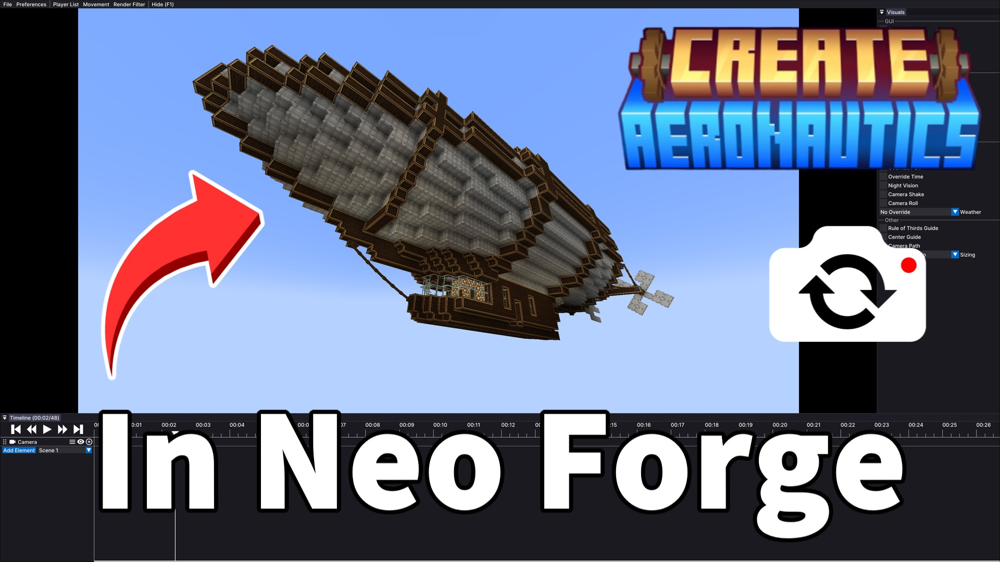
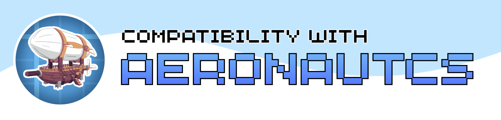
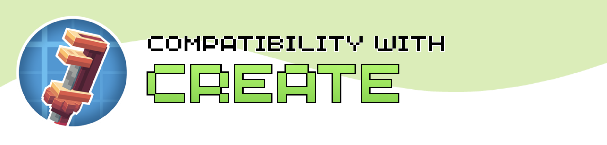

<p align="center"></p>
<h1 align="center">Flashback Neoforge Fixed<br>
	<a href="https://www.curseforge.com/minecraft/mc-mods/[]"></a>
    <a href="https://modrinth.com/mod/[]"></a>
</h1>

Compatibility fixes for running [Flashback](https://modrinth.com/mod/flashback) on
NeoForge 1.21.1 through Sinytra Connector. The mod preserves modded packets and replay
snapshot state, with additional compatibility for Create, Sable-based sub-levels,
Create: Aeronautics, Voxy, and several rendering integrations.



<p align="center">
  <a href="https://www.curseforge.com/minecraft/mc-mods/[]">
    
  </a>
  <a href="https://modrinth.com/mod/[]">
    
  </a>
</p>

<h1>Requirements</h1>

- Minecraft 1.21.1
- NeoForge 21.1 or newer
- [Sinytra Connector](https://www.curseforge.com/minecraft/mc-mods/sinytra-connector)
- [Forgified Fabric API](https://www.curseforge.com/minecraft/mc-mods/forgified-fabric-api)
- [Flashback](https://modrinth.com/mod/flashback) 0.39 or newer

Sable, Create, Voxy, and the other supported integrations are optional.

<h1>Compatibility</h1>

<p align="center">
  
  <br>Create: Aeronautics sub-level recording and riding state
</p>

<p align="center">
  
  <br>Create trains and elevators
</p>

<p align="center">
  
  <br>Voxy replay storage and distant terrain rendering
</p>

<h1>Building</h1>

Java 21 is required. This repository does not redistribute third-party mod jars.
Before building, place these compile-only dependencies in `libs/`:

- `Flashback-0.39.7-for-MC1.21.1_mapped_moj_1.21.1.jar`
- `sable-neoforge-1.21.1-2.0.5.jar`
- `sable-companion-common-1.21.1-1.6.0.jar`

The Flashback jar must use Mojang mappings, matching the jar produced by Connector's
remapping cache. Then run:

```text
./gradlew build
```

On Windows, use `gradlew.bat build`. The built mod is written to `build/libs/`.

<h1>License</h1>

This project is available under the [MIT License](LICENSE).

Gallery equipment shown in project images includes
[v2-survival-friendly-airship](https://createmod.com/schematics/v2-survival-friendly-airship)
and [cogrider-car](https://createmod.com/schematics/cogrider-car).
