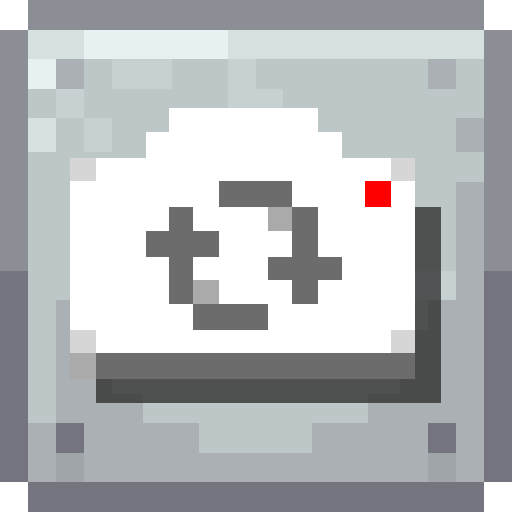
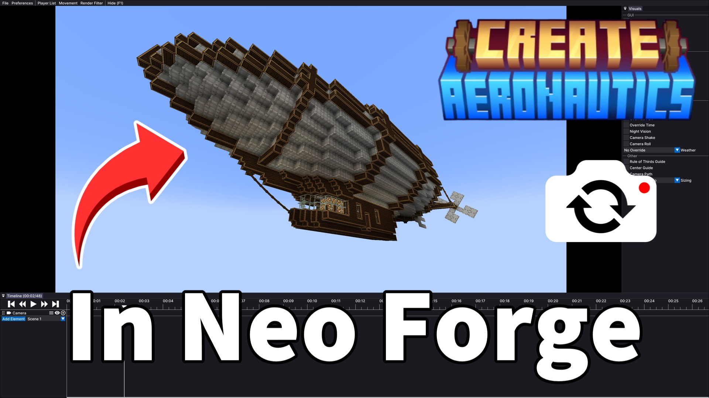
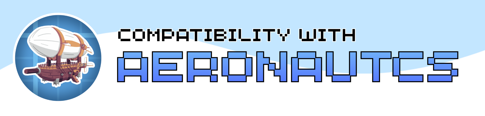

<p align="center"></p>
<h1 align="center">Flashback Neoforge Fixed<br>
	<a href="https://www.curseforge.com/minecraft/mc-mods/flashback-neoforge-fixed"></a>
    <a href="https://modrinth.com/mod/flashback-neoforge-fixed"></a>
</h1>

Compatibility fixes for running [Flashback](https://modrinth.com/mod/flashback) on
NeoForge 1.21.1 through Sinytra Connector. The mod preserves modded packets and replay
snapshot state, with additional compatibility for Create, Sable-based sub-levels,
Create: Aeronautics, Create: Cosmonautics, Voxy, and several rendering integrations.



<p align="center">
  <a href="https://www.curseforge.com/minecraft/mc-mods/flashback-neoforge-fixed">
    
  </a>
  <a href="https://modrinth.com/mod/flashback-neoforge-fixed">
    
  </a>
</p>

<h1>Requirements</h1>

- Minecraft 1.21.1
- NeoForge 21.1 or newer
- [Sinytra Connector](https://www.curseforge.com/minecraft/mc-mods/sinytra-connector)
- [Forgified Fabric API](https://www.curseforge.com/minecraft/mc-mods/forgified-fabric-api)
- [Flashback](https://modrinth.com/mod/flashback) 0.39 or newer

Sable, Create, Voxy, and the other supported integrations are optional.

When Simple Voice Chat is installed, Flashback's voice-chat plugin is registered with its
NeoForge loader automatically. Voice recording is disabled by default and must be enabled in
Flashback's config file before starting a recording: open `config/flashback/flashback.json`
(the `config` folder next to your `mods` folder) and set `"recordVoiceChat"` to `true`. Voice
audio cannot be reconstructed in recordings made while it was disabled.

Create: Cosmonautics' live universe simulation is disabled only inside Flashback's
partial replay server, where the `rocketnautics:deep_space` dimension is intentionally
absent. Normal worlds and dedicated servers continue to simulate it normally.

Small mod-added pause-menu buttons keep their normal position unless they overlap Flashback's
recording controls. A colliding button moves only to the next free slot on its right, while its
vertical position remains unchanged.

The title-screen replay-list button likewise keeps Flashback's original position. When a small
control added after screen initialization occupies that slot, the late-added control moves down
instead of pushing the replay-list button farther to the right.

Create: The Air War 4.67's tooltip cache is also protected from concurrent creative-search
updates when that optional mod is installed.

Recorded custom payloads are forwarded to the replay client byte-for-byte. This preserves lazy
data-registry synchronization used by Cobblemon and prevents later battle packets from being
decoded against an accidentally emptied species registry.

Legacy recordings whose NeoForge registry metadata cannot distinguish simple and multi-state
Copycats block entities recover their recorded material across every active part. This prevents
Copycat Bytes and similar blocks from crashing Sodium's chunk builder when a replay is opened.

Legacy `Create: Flashback` and `Create: Aeronautics Flashback` installations are not
required because their compatibility features are included here. Version 1.0.9 and newer
will tolerate those legacy mods, but removing them avoids duplicate replay handlers.

<h1>Compatibility</h1>

<p align="center">
  
  <br>Create: Aeronautics sub-level recording, rewind-safe state replacement, and dedicated-server support
</p>

<p align="center">
  
  <br>Create trains, elevators, and FramedBlocks camo on contraptions
</p>

<p align="center">
  
  <br>Voxy replay storage and distant terrain rendering
</p>

<h1>Building</h1>

Java 21 is required. This repository does not redistribute third-party mod jars.
Before building, place these compile-only dependencies in `libs/`:

- `Flashback-0.39.7-for-MC1.21.1_mapped_moj_1.21.1.jar`
- `sable-neoforge-1.21.1-2.0.5.jar`
- `sable-companion-common-1.21.1-1.6.0.jar`

The Flashback jar must use Mojang mappings, matching the jar produced by Connector's
remapping cache. Then run:

```text
./gradlew build
```

On Windows, use `gradlew.bat build`. The built mod is written to `build/libs/`.

<h1>License</h1>

This project is available under the [MIT License](LICENSE).

Gallery equipment shown in project images includes
[v2-survival-friendly-airship](https://createmod.com/schematics/v2-survival-friendly-airship)
and [cogrider-car](https://createmod.com/schematics/cogrider-car).
